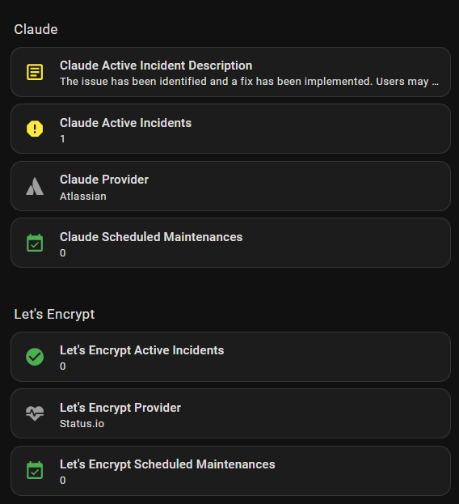

# StatusPage Monitor

[](https://github.com/TheLion/statuspage-HA/releases)
[](https://analytics.home-assistant.io)
[](https://github.com/TheLion/statuspage-HA/commits/statuspage-monitor-main)
[](https://github.com/TheLion/statuspage-HA)
[](LICENSE)

Home Assistant custom integration that monitors status pages and exposes health
data as sensors — overall status, active incidents, scheduled maintenances, and
one sensor per service component.

The provider is **auto-detected from the URL**. Just enter the status page
address and the integration handles the rest.


---

## Supported providers

| Provider | Detection | Notes |
|----------|-----------|-------|
| **Atlassian Statuspage** | `/api/v2/summary.json` | The most widely used platform. Covers GitHub, Cloudflare, Atlassian, Anthropic, OpenAI, Twilio, Datadog, and hundreds more |
| **Status.io** | `statuspageId` in page HTML | Two-step: extracts page ID from HTML, then calls the Status.io API |
| **UptimeRobot** | `window.pspApiPath` in page HTML | Monitors + event feed fetched in parallel; overall status derived from worst monitor |
| **Instatus** | `/summary.json` | Hosted platform used by hundreds of services on custom domains or `*.instatus.com` |
| **Sorry™** | `/api/v1/` | Hosted platform used by services like Moneybird, Broadcom, and Pingdom |
| **Cachet** | `/api/v1/ping` or `/api/ping` | Self-hosted open-source. Supports both v2 (`/api/v1`) and v3 (`/api`) |

### Provider feature comparison

| Feature | Atlassian | Status.io | UptimeRobot | Instatus | Sorry™ | Cachet |
|---------|:---------:|:---------:|:-----------:|:--------:|:------:|:------:|
| Overall status | ✅ | ✅ | ✅ (from worst monitor) | ✅ | ✅ | ✅ (from worst component) |
| Component sensors | ✅ | ✅ | ✅ (one per monitor) | ✅ | ✅ | ✅ |
| Active incidents | ✅ | ✅ | ✅ (from event feed) | ✅ | ✅ | ✅ |
| Incident body text | ✅ | ✅ | ✅ | ❌ | ✅ | ✅ |
| Scheduled maintenances | ✅ | ✅ | ✅ (from event feed) | ✅ | ✅ | ✅ (v2 only) |
| Component groups | ✅ | ❌ | ✅ (monitor groups) | ✅ | ✅ | ✅ |
| Self-hosted | ❌ | ❌ | ❌ | ❌ | ❌ | ✅ |

---

## Sensors

Each configured status page gets a dedicated device with the following sensors.
Entity IDs follow the pattern `sensor.statuspage_<page_name>_<sensor>`.

| Sensor | Type | Values / notes |
|--------|------|----------------|
| `_provider_info` | Text | Short provider name (e.g. "Atlassian") |
| `_overall_status` | Enum | `none` · `minor` · `major` · `critical` |
| `_active_incidents` | Count | Number of unresolved incidents. Attribute: `incidents` list |
| `_active_incident_description` | Text | Latest update body of the first active incident. `unknown` when none |
| `_scheduled_maintenances` | Count | Number of upcoming / in-progress windows. Attribute: `maintenances` list |
| `_<component_slug>` | Enum | One per component: `operational` · `degraded_performance` · `partial_outage` · `major_outage` · `under_maintenance` |

Component sensors are **discovered dynamically** — new components that appear
after the first poll are automatically added without a restart.

### Icon and colour attributes

Every sensor exposes two extra attributes that drive dashboard cards:

| Attribute | Example value | Purpose |
|-----------|---------------|---------|
| `icon` | `mdi:alert-circle` | Current MDI icon reflecting the status |
| `icon_color` | `orange` | HA colour name for the icon |

**These attributes only work with Mushroom Cards and auto-entities** (see
[Dashboard cards](#dashboard-cards) below). Standard Lovelace entity cards do
not support dynamic icon colours from attributes.

### Status values and icons

**Overall status / incidents**

| State | `icon` | `icon_color` |
|-------|--------|-------------|
| `none` | `mdi:check-circle` | `green` |
| `minor` | `mdi:alert` | `yellow` |
| `major` | `mdi:alert-circle` | `orange` |
| `critical` | `mdi:close-circle` | `red` |

**Component status**

| State | `icon` | `icon_color` |
|-------|--------|-------------|
| `operational` | `mdi:check-circle` | `green` |
| `degraded_performance` | `mdi:alert` | `yellow` |
| `partial_outage` | `mdi:alert-circle` | `orange` |
| `major_outage` | `mdi:close-circle` | `red` |
| `under_maintenance` | `mdi:wrench-clock` | `blue` |

---

## When the status page changes

Status pages are not static — components get added, removed, or renamed over
time. Here is how the integration handles each scenario:

| Scenario | Behaviour |
|----------|-----------|
| **Component added** | A new sensor is created automatically on the next poll. No restart required. |
| **Component removed** | The sensor becomes `unavailable`. It is not deleted automatically — remove it manually via **Settings → Devices & Services**. |
| **Component renamed** | The sensor name updates automatically (it reads the name live from the API). The entity ID stays the same — it was assigned at creation time and is not changed by renames. |
| **Page name changed** | Sensor attributes (e.g. `page_name`) update automatically. Existing entity IDs are not affected. |

**Why are removed components not deleted automatically?**
Automatically removing entities would silently break any automations,
dashboards, or scripts that reference them. Keeping the sensor as `unavailable`
makes it visible that something changed, so you can decide what to do.

---

## Dashboard cards

The `icon` and `icon_color` attributes are designed for use with the
**Mushroom Template Card** and **auto-entities**. Both are available via HACS.

Required HACS frontend dependencies:
- [Mushroom](https://github.com/piitaya/lovelace-mushroom)
- [auto-entities](https://github.com/thomasloven/lovelace-auto-entities)

### Show only non-operational components

The card below automatically lists all non-operational and non-idle sensors for
a given status page (e.g. Cloudflare), hiding everything that is `operational`,
`none`, or `unknown`.

```yaml
type: custom:auto-entities
card:
  type: grid
  columns: 1
  square: false
card_param: cards
filter:
  include:
    - options:
        type: custom:mushroom-template-card
        primary: "{{ state_attr(config.entity, 'friendly_name') }}"
        secondary: "{{ states(config.entity) }}"
        icon: "{{ state_attr(config.entity, 'icon') }}"
        icon_color: "{{ state_attr(config.entity, 'icon_color') }}"
      entity_id: sensor.statuspage_cloudflare_*
  exclude:
    - options: {}
      state: operational
    - options: {}
      state: none
    - options: {}
      state: unknown
sort:
  method: friendly_name
```



Change `sensor.statuspage_cloudflare_*` to match your own page slug.

### Single component with colour

```yaml
type: custom:mushroom-template-card
entity: sensor.statuspage_cloudflare_cdn
primary: "{{ state_attr(config.entity, 'friendly_name') }}"
secondary: "{{ states(config.entity) }}"
icon: "{{ state_attr(config.entity, 'icon') }}"
icon_color: "{{ state_attr(config.entity, 'icon_color') }}"
```

### Overall status with description

```yaml
type: custom:mushroom-template-card
entity: sensor.statuspage_cloudflare_overall_status
primary: "{{ state_attr(config.entity, 'page_name') }}"
secondary: "{{ state_attr(config.entity, 'description') }}"
icon: "{{ state_attr(config.entity, 'icon') }}"
icon_color: "{{ state_attr(config.entity, 'icon_color') }}"
```

---

## Installation

### Via HACS (recommended)

1. Open HACS → **Integrations** → three-dot menu → **Custom repositories**.
2. Add `https://github.com/TheLion/statuspage-HA` as an **Integration**.
3. Install **StatusPage Monitor** and restart Home Assistant.

### Manual

1. Copy `custom_components/statuspage_monitor/` into your
   `config/custom_components/` directory.
2. Restart Home Assistant.

### Integration logo

The integration logo is bundled and visible in the HA integrations panel without
any extra setup. HA 2026.3.0+ uses the `brand/` subfolder (new brands proxy API);
older versions fall back to `icon.png` in the integration root (legacy static
file endpoint). No minimum HA version is required.

---

## Configuration

### Add a status page

1. **Settings → Devices & Services → + Add Integration → StatusPage Monitor**
2. Enter the base URL of the status page (e.g. `https://www.cloudflarestatus.com`).
3. Optionally adjust the polling interval (default 60 s, min 30 s, max 3600 s).
4. Submit — the provider is detected and all sensors are created automatically.

Repeat for each additional status page. Every page is an independent device.

### Change the polling interval

**Settings → Devices & Services → StatusPage Monitor → Configure**

### Rate limiting

Polling faster than 30 seconds is not recommended and may result in temporary
throttling by some providers. The integration enforces a minimum of 30 seconds.

---

## Examples of compatible status pages

| Service | URL | Provider |
|---------|-----|----------|
| Claude (Anthropic) | https://status.claude.com | Atlassian Statuspage |
| GitHub | https://www.githubstatus.com | Atlassian Statuspage |
| Cloudflare | https://www.cloudflarestatus.com | Atlassian Statuspage |
| iRobot | https://status.irobot.com | Status.io |
| Let's Encrypt | https://letsencrypt.status.io | Status.io |
| Status.io | https://status.status.io | Status.io |
| UptimeRobot | https://status.uptimerobot.com | UptimeRobot |
| iPone | https://status.ipone.nl | UptimeRobot |
| Connectify | https://status.connectify.me | UptimeRobot |
| openSUSE (v2) | https://status.opensuse.org | Cachet |
| Cachet demo (v2) | https://demo.cachethq.io | Cachet |
| Cachet demo (v3) | https://v3.cachethq.io | Cachet |
| Polymarket | https://status.polymarket.com | Instatus |
| Sketch | https://status.sketch.com | Instatus |
| Todoist | https://status.todoist.net | Instatus |
| Moneybird | https://status.moneybird.com | Sorry™ |
| Broadcom | https://status.broadcom.com | Sorry™ |
| Joinblink | https://status.joinblink.com | Sorry™ |
| Pingdom | https://status.pingdom.com | Sorry™ |

> Atlassian Statuspage is used by hundreds of services (Cloudflare, Datadog,
> Twilio, Atlassian, OpenAI, and many more) — just enter any compatible URL.
>
> Instatus and Sorry™ are each used by hundreds of services on custom domains —
> just enter any compatible URL.
>
> Cachet is self-hosted, so any self-managed Cachet instance can be monitored
> by entering its base URL. The demo instances above may not always be available.

---

## License

MIT – see [LICENSE](LICENSE).
